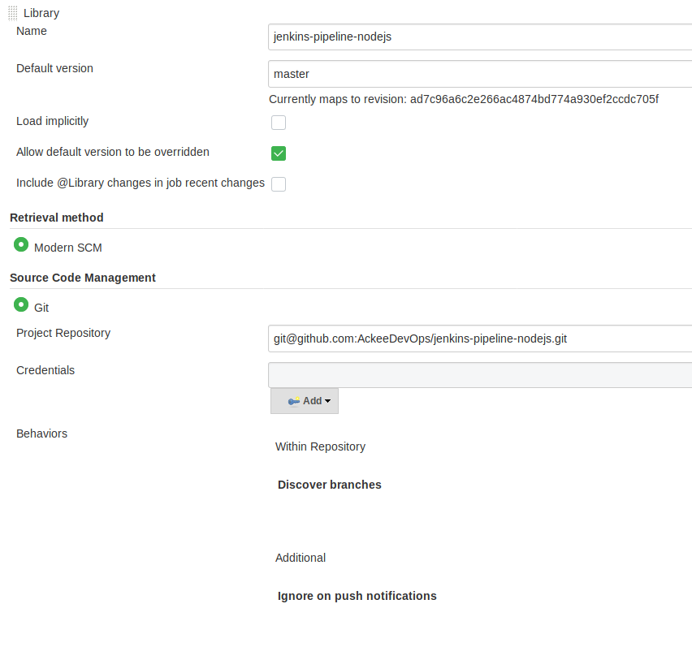

# Nodejs Merge Request builder

In this example we're gonna show you how we reused basic components from the
Nodejs pipeline library to create a Merge Requests builder which executes
CI tests and linting in every Gitlab merge request.

## Jenkins configuration
Make sure you have included this library first.

```
home > Manage Jenkins > Configure System > Global Pipeline Libraries
```



## Jenkins job configuration

1. Check option `Do not allow concurrent jobs`
2. Set up Gitlab connection
3. In the build trigger section set following options:
  - Check option `Opened Merge Request Events`
  - Rebuild open Merge Requests: select option `On push to source or target branch`
  - Check option `Comments`
  -	Comment (regex) for triggering a build: arbitrary text you want to use for triggering a new build
4. In the Pipeline section set following:
  - Definition: select option `Pipeline script`
  - Script: Copy & Paste source code from [mr-builder.groovy](mr-builder.groovy)

**General section**


**Build section**


**Pipeline section**


## Gitlab configuration
TBD 👷
